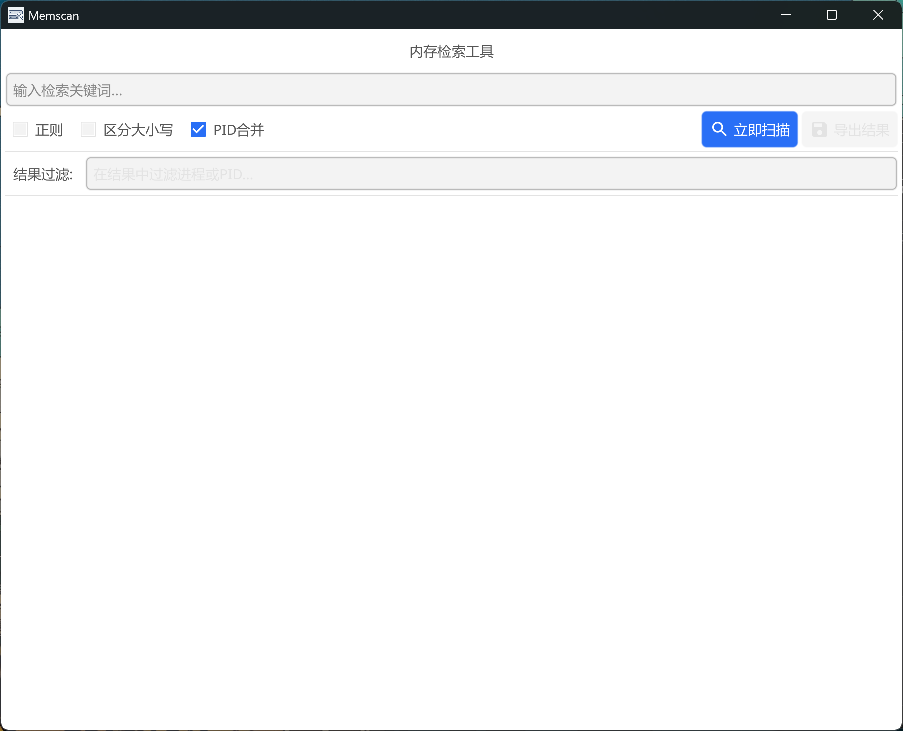

# 🔍 Memscan 内存检索工具

大模型辅助下（Gemini+豆包）使用Go语言编写的Windows 应急响应工具，快速扫描全进程内存中的恶意域名 / IP / 特征码，自动关联进程活跃 TCP 外联。

---

## ✨ 核心功能
- 全进程可读 / 可执行内存区域扫描
- 支持正则匹配、大小写区分
- 自动关联进程 TCP 活跃外联信息
- PID 合并 / 平铺双模式结果展示
- 结果实时过滤与 TXT 报告导出
- 单 EXE 无依赖，隔离网即插即用

### 📌 注意
文件运行需要管理员权限，否则某些进程扫描不到

---

## 🖼️ 软件截图

   
  
    

---
## 🤝 贡献与反馈
- 欢迎提交 Issue 反馈问题、提出功能建议
- 欢迎 Fork 仓库进行二次开发，提交 PR 合并到主分支
- 如果觉得工具好用，欢迎 Star ⭐ 支持！

---

## ⚠️ 免责声明
**本工具仅用于合法的应急响应、安全测试与恶意软件分析场景。**

- 使用本工具需严格遵守《中华人民共和国网络安全法》及相关法律法规
- 禁止用于任何未授权的攻击、入侵或破坏行为
- 作者不对因滥用本工具造成的任何直接或间接损失承担责任
