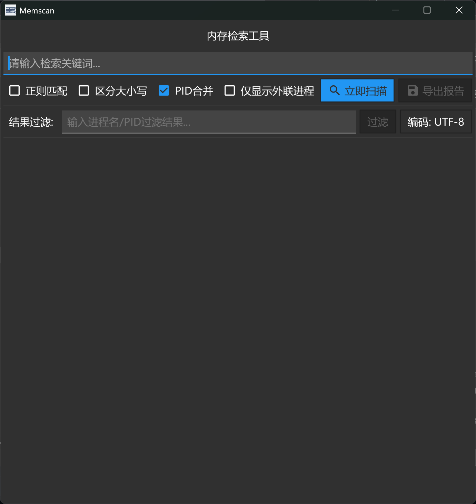

# 🔍 Memscan 内存检索工具

大模型辅助下使用 Go 语言编写的 Windows 应急响应工具：全进程内存中快速检索恶意域名 / IP / 特征码，命中后自动关联进程 TCP 外联（IPv4 + IPv6），用于排查“已知 IOC 落在哪个进程、该进程是否正在联网”。

## 核心功能

- 多编码关键词搜索：UTF-8 / UTF-16LE / UTF-16BE / GBK / Big5 / Shift-JIS，命中后按对应编码解码上下文，中文直接可读
- 自动关联进程 TCP 外联（IPv4 + IPv6），联网进程以红色 `<!>` 标记
- 支持正则匹配（RE2 语法，仅 UTF-8）、区分大小写
- 真实命中数统计 + 展开结果懒加载分页，翻页 / 折叠自动释放资源
- PID 合并 / 平铺双模式展示，结果实时过滤，TXT 报告导出（含外联地址与编码信息）
- GUI + CLI 双模式，单 EXE 无依赖，隔离网即插即用

## 命令行

```bash
# 交互模式（也可直接双击 Memscan_CLI.exe）
Memscan.exe cli

# 一次性扫描
Memscan.exe cli <关键词> [选项]

# 常用选项：-a 全量编码 | -net 仅外联进程 | -list 紧凑列表 | -max N 输出上限 | -h 帮助
```

## 截图



## 编译

需要 Go 1.20.x（最后支持 Windows 7 / 8 / Server 2008 / Server 2012 的版本）。

```bash
# GUI 版（无控制台黑框）
go build -ldflags "-H windowsgui -s -w" -o Memscan.exe .

# CLI 版（带控制台）
go build -ldflags "-s -w" -o Memscan_CLI.exe .
```

## 注意

- 建议以**管理员权限**运行，否则无法读取部分高权限进程的内存
- `<!>` 标记仅表示进程当前有外联连接，不代表连接的就是所搜 IOC，命中后建议用 TCPView 等工具核实
- 仅扫描 RW / RWX 内存区域，单区域超过 500MB 会跳过；每进程最多存储 200 条命中用于分页（真实命中数不受限）

## 免责声明

本工具仅用于合法的应急响应、安全测试与恶意软件分析场景，请严格遵守《中华人民共和国网络安全法》及相关法律法规，禁止用于任何未授权的攻击、入侵或破坏行为。
